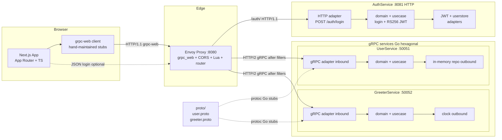

# Architecture

## System Diagram



Envoy routes by path prefix (`/auth/`, `/user.v1.UserService`, `/greeter.v1.GreeterService`). For gRPC paths it runs `tenant_check.lua`: compares JWT `tenant` claim to the request `Host` subdomain (see [envoy.md](envoy.md)). Login under `/auth/` skips that check.

## Hexagonal Architecture

**gRPC services** (`services/user`, `services/greeter`):

```
services/<name>/
├── cmd/server/main.go          # Composition root
└── internal/
    ├── domain/
    ├── usecase/
    ├── port/
    └── adapter/
        ├── grpcserver/         # Inbound gRPC to usecase
        └── memory/             # Outbound in-memory
```

**Auth service** (`services/auth`):

```
services/auth/
├── cmd/server/main.go
└── internal/
    ├── domain/
    ├── usecase/
    ├── port/
    └── adapter/
        ├── http/               # Inbound HTTP login
        ├── jwt/                # RS256 sign and verify
        └── userstore/          # Hardcoded users
```

**Key rules:**

- Domain and usecase avoid infrastructure imports except standard library and port types.
- Adapters depend inward on ports; ports do not depend on adapters.
- `main.go` wires concrete adapters.

## Services

| Service | Port | Protocol | Responsibilities |
|---------|------|----------|------------------|
| UserService | 50051 | gRPC | `CreateUser`, `GetUser` |
| GreeterService | 50052 | gRPC | `SayHello`, `SayGoodbye` |
| AuthService | 8081 | HTTP | `POST /auth/login` JSON, RS256 JWT with `tenant` from `Host` |

## Data Flow

### gRPC through Envoy (browser or tools)

1. Client sends HTTP request to Envoy `:8080` (grpc-web from browser, or raw path for curl).
2. **grpc_web** filter rewrites grpc-web to native gRPC where applicable.
3. **cors** filter applies virtual-host CORS rules.
4. **lua** (`envoy/filters/tenant_check.lua`) on non-`/auth/*` paths: requires `Authorization: Bearer`, parses JWT `tenant`, matches first label of `Host`; **401**/**403** on failure.
5. **router** forwards to `user_service` or `greeter_service` cluster (HTTP/2).
6. Go gRPC adapter decodes protobuf, calls usecase, returns response upstream through the same filter chain (grpc_web reframes for browser).

### Login

1. `POST /auth/login` with JSON body to Envoy (path prefix `/auth/`).
2. Lua skips tenant check for `/auth/*`.
3. Router forwards to `auth_service` cluster (HTTP/1.1 to `:8081`).
4. Auth HTTP handler returns `{ "token": "<JWT>" }`; no protobuf.
