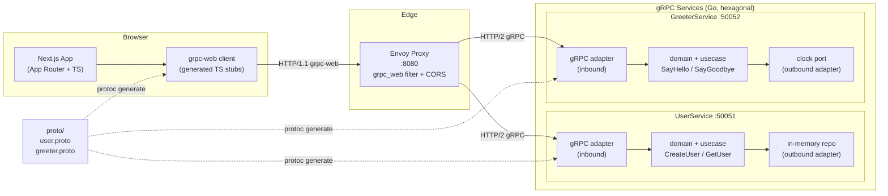

# Architecture

## System Diagram



## Hexagonal Architecture

Each Go service follows the ports-and-adapters (hexagonal) pattern:

```
services/<name>/
├── cmd/server/main.go          # Composition root — wires adapters to ports
└── internal/
    ├── domain/                 # Core entities and domain errors
    ├── usecase/                # Application logic (depends only on ports)
    ├── port/                   # Interfaces (inbound + outbound contracts)
    └── adapter/
        ├── grpcserver/         # Inbound adapter: gRPC → usecase
        └── memory/             # Outbound adapter: usecase → in-memory store
```

**Key rules:**
- Domain and usecase packages have zero infrastructure imports.
- Adapters depend inward on ports; ports never depend on adapters.
- `main.go` is the only place that knows about concrete adapter types.

## Services

| Service | Port | Methods |
|---------|------|---------|
| UserService | 50051 | `CreateUser(name) → (id, name)`, `GetUser(id) → (id, name)` |
| GreeterService | 50052 | `SayHello(name) → message`, `SayGoodbye(name) → message` |

## Data Flow

1. Browser makes HTTP/1.1 request using grpc-web binary format
2. Envoy's `grpc_web` filter translates to HTTP/2 gRPC
3. Envoy routes by service prefix (`/user.v1.UserService`, `/greeter.v1.GreeterService`)
4. Go gRPC adapter deserializes proto, calls usecase
5. Usecase executes domain logic via port interfaces
6. Response flows back through the same chain
